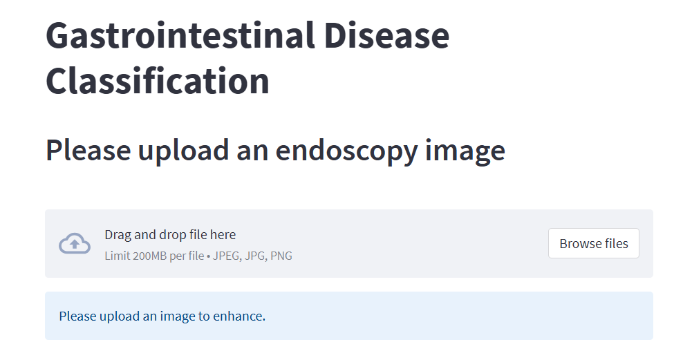
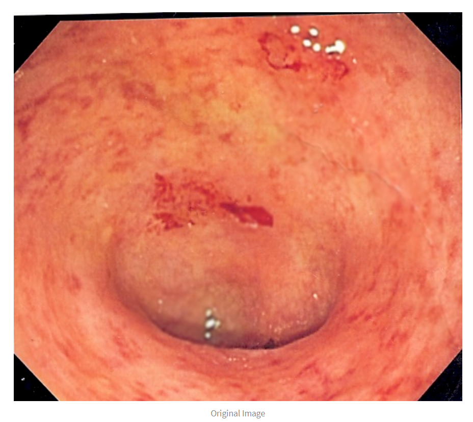
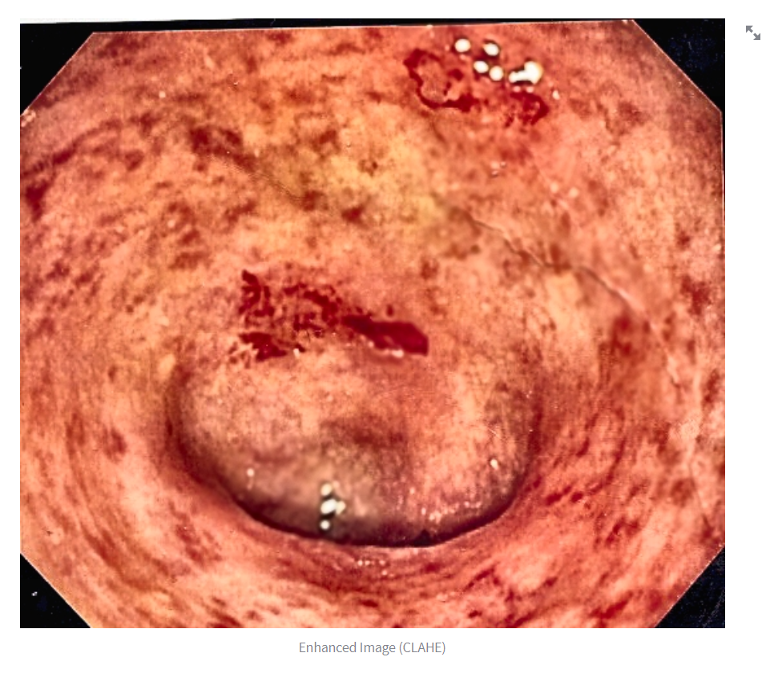

# Gastrointestinal disease classification
This project aims to classify 4 types of Gastrointestinal Diseases (angiodysplasia, esophagitis, polyps, ulcerative-colitis) using endoscopy images. Image Contrast Enhancement technique (CLAHE) is being applied on endoscopy images to improve visibility and diagnostic accuracy.

### The website

### Original Image

### Enhanced Image

### Prediction

### Credits 
Dataset 1: https://datasets.simula.no/kvasir/
Dataset 2: https://www.kaggle.com/datasets/capsuleyolo/kyucapsule 
